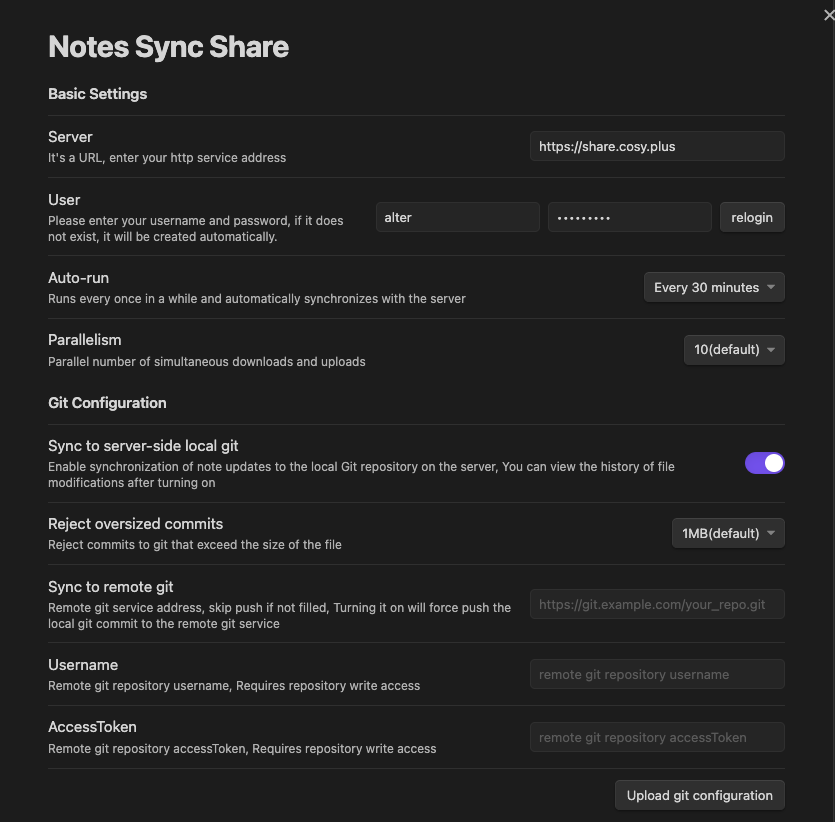
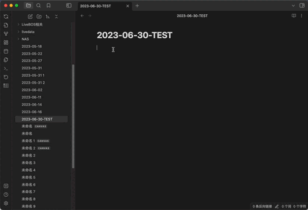
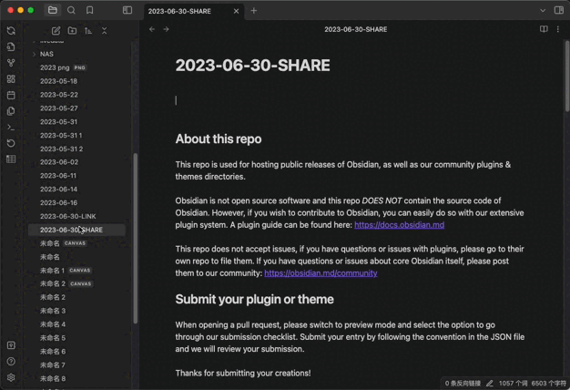
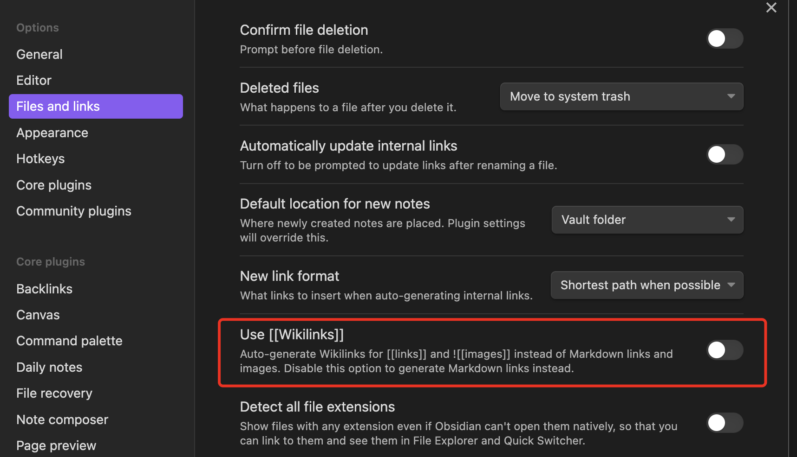

# Notes Sync Share

**Notes Sync Share** 是一个 Obsidian 插件，允许你将笔记同步和分享（发布）到你自己的私有服务。通过这个插件，你可以轻松地将 Obsidian 笔记同步到自托管的服务，并完全掌控你的数据。

## 特点

- **同步**: 无缝同步你的 Obsidian 笔记到你的私有服务。你的笔记将始终在多个设备上保持最新。
- **发布与分享**: 轻松地将选定的笔记发布和分享到你的私有服务。与他人共享你的知识，或与团队成员合作。
- **隐私与控制**: 保持你的笔记安全和私密。你的数据存储在你自己的自托管服务中，让你完全掌控你的信息。

注：同步和分享功能可以独立使用，你可以只使用其中之一，例如：只使用分享功能，而同步功能则可以通过其他 Obsidian 插件来完成。

## 截图

### 配置



### 同步与历史



### 分享



## 入门指南

1. 在你的 Obsidian 应用中安装 **Notes Sync Share** 插件。
2. 部署后端服务。
3. 使用你的私有服务的 URL 和凭证配置插件设置。
4. 选择你想要同步或发布的笔记。
5. 享受无缝同步和分享你的笔记。

## 后端服务部署

### 在部署前先试用

试用作者的后端服务：`https://share.alter.run`，将该地址配置到你的插件中。

注：出于更好的隐私保护，最好使用你自己部署的服务。

### 使用 Docker

#### 快速开始

要快速启动 Obsidian 同步分享服务器，请执行以下命令：

```shell
docker run -d \
--name obsidian-sync-share-server \
-p 80:8080 \
-v "/root/obsidian-sync-share-server/user_store:/app/user_store" \
alterzz/obsidian-sync-share-server
```

该命令将在后台启动一个容器，将主机上的端口 80 映射到容器中的端口 8080，并将主机上的 /root/obsidian-sync-share-server/user_store 目录挂载到容器中的 /app/user_store 目录。

#### 配置 HTTPS


```shell
docker run -d \
--name obsidian-sync-share-server \
-p 443:8080 \
-v "/root/obsidian-sync-share-server/user_store:/app/user_store" \
-v "/root/obsidian-sync-share-server/share.alter.run.jks:/app/cert.jks" \
-e server.ssl.key-store-type=JKS \
-e server.ssl.key-store=/app/cert.jks \
-e server.ssl.key-store-password=xxxx \
alterzz/obsidian-sync-share-server
```

此命令允许你指定额外的参数来配置服务器。下面是每个参数的解释：

- -p 443:8080：将主机上的端口 443 映射到容器中的端口 8080。根据需要修改主机端口。
- -v "/root/obsidian-sync-share-server/user_store:/app/user_store"：将主机上的 /root/obsidian-sync-share-server/user_store 目录挂载到容器中的 /app/user_store 目录。根据需要调整主机目录路径。
- -v "/root/obsidian-sync-share-server/share.alter.run.jks:/app/cert.jks"：将主机上的 share.alter.run.jks 文件挂载到容器中的 /app/cert.jks 文件。请更新主机文件路径。
- -e server.ssl.key-store-type=JKS：将 SSL 密钥库类型设置为 JKS。如果使用不同类型，请进行修改。
- -e server.ssl.key-store=/app/cert.jks：指定容器内 SSL 密钥库文件的位置。根据需要进行调整。
- -e server.ssl.key-store-password=xxxx：设置 SSL 密钥库的密码。将 xxxx 替换为实际密码。

#### 其他配置

限制内存

`-e JAVA_OPTS=-Xmx512m` 

修改git默认分支名称，默认为master, 以下示例将默认分支名称设置为 main

```shell
echo "[init] \n    defaultBranch = main" > ~/gitconfig_temp

docker cp ~/gitconfig_temp obsidian-sync-share-server:~/.gitconfig
```

禁用或允许自动注册操作

```
# 创建一个名为“registration_lock”的文件并将其放在与程序相同的目录中将禁用自动注册。
docker exec obsidian-sync-share-server touch /app/registration_lock

# 删除这个文件将允许自动注册
docker exec obsidian-sync-share-server rm /app/registration_lock
```

#### 尝试访问

使用你的服务器 IP 地址或域名来访问你的服务，端口是之前在 Docker 中配置的监听端口。

http://{你的服务器 IP}

或

https://{你的服务器 IP}

#### 删除或重建

```shell
docker stop obsidian-sync-share-server
docker rm obsidian-sync-share-server

# rebuild
# ...

# view Log
docker logs obsidian-sync-share-server
```

### 源代码部署

请访问 [obsidian-sync-share-web](https://github.com/Alt-er/obsidian-sync-share-web)。

请访问 [obsidian-sync-share-server](https://github.com/Alt-er/obsidian-sync-share-server)。

### 同步到远程 Git

#### 配置

请前往插件配置页面，配置以下内容。

注：每次同步都会使用强制推送（Force push）。

- 远程 Git 仓库地址
- 用户名和访问令牌（AccessToken）

#### 获取 GitHub 访问令牌

- 打开 GitHub 网站并登录你的账户。
- 点击右上角的个人头像，选择 "Settings"。
- 在左侧边栏中，选择 "Developer settings"。
- 在左侧边栏中，选择 "Personal access tokens"。
- 点击 "Generate new token"。
- 在 "Note" 字段中输入一个描述性名称，以记住这个访问令牌的用途。
- 从列表中选择所需的权限（例如，读取仓库、写入仓库等）。
- 在页面底部点击 "Generate token"。
- 复制生成的访问令牌。

#### 获取 GitLab 访问令牌

- 打开 GitLab 网站并登录你的账户。
- 点击右上角的个人头像，选择 "Settings"。
- 在左侧边栏中，选择 "Access Tokens"。
- 在 "Name" 字段中输入一个描述性名称，以记住这个访问令牌的用途。
- 在 "Scopes" 部分，选择所需的权限（例如，API、仓库等）。
- 在页面底部点击 "Create personal access token"。
- 复制生成的访问令牌。

## 常见问题 (FAQ)

### 1. 同步时卡住并提示: "Other clients are in the process of synchronization, please try later"

Q：删除文件：`/app/user_store/{username}/sync_lock`可以手动解锁。以上是docker部署的路径。如果是手动部署，请在您手动指定的目录中搜索该文件。

如果解锁后再次出现该问题，则说明您的同步过程出现问题。 常见的情况是，使用反向代理（nginx）时，上传的文件大小超出了使用默认配置时的限制。 还可能存在其他问题，可以使用 `docker log obsidian-sync-share-server` 查看错误堆栈。 如果方便的话可以发给我，我会具体分析问题。

### 2. 链接被当做文本无法跳转

Q: 不要使用 wikilinks


## 反馈与贡献

如果你遇到任何问题，有建议，或想为 **Notes Sync Share** 的开发做出贡献，请访问 [GitHub 仓库](https://github.com/Alt-er/obsidian-sync-share)。非常感谢你的反馈和贡献。

## 许可证

该插件在 [MIT 许可证](https://github.com/Alt-er/obsidian-sync-share/blob/master/LICENSE) 下发布。

---

**Notes Sync Share** 与 Obsidian 或 Obsidian 团队无关，它是由 Alt-er 开发的独立插件。