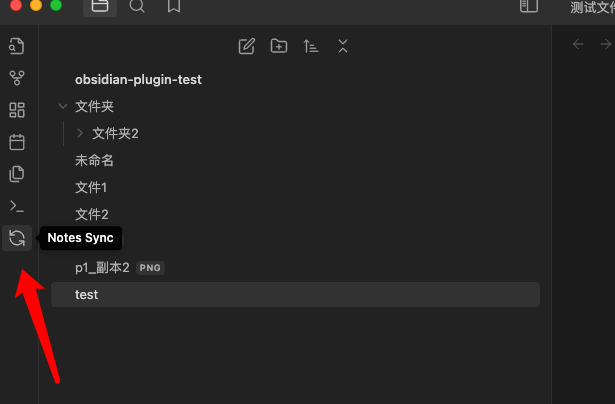
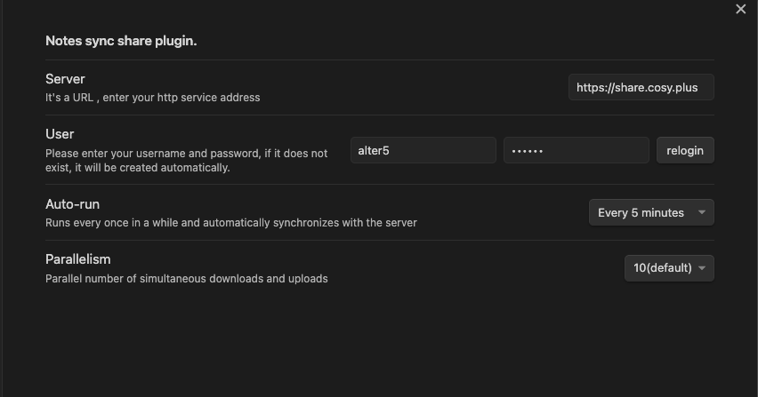
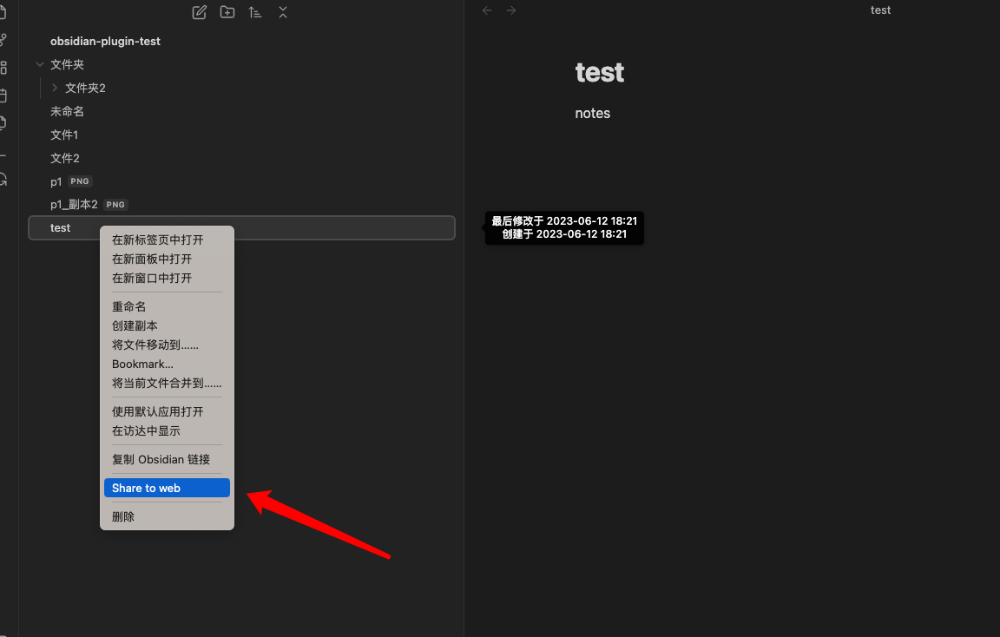

# Notes Sync Share

**Notes Sync Share** is an Obsidian plugin that allows you to synchronize and share (publish) your notes to your own private service. With this plugin, you can easily sync your Obsidian notes to a self-hosted service and have full control over your data.

## Features

- **Sync**: Seamlessly sync your Obsidian notes to your private service. Your notes will always be up to date across multiple devices.
- **Publish and Share**: Easily publish and share selected notes to your private service. Share your knowledge with others or collaborate with teammates.
- **Privacy and Control**: Keep your notes secure and private. Your data is stored in your own self-hosted service, giving you full control over your information.

## Getting Started

1. Install the **Notes Sync Share** plugin in your Obsidian app.
2. Deploy back-end services
3. Configure the plugin settings with the URL and credentials of your private service.
4. Choose the notes you want to sync or publish.
5. Enjoy seamless synchronization and sharing of your notes.

## Back-end Service Deployment

### Try it out before you deploy it

Try the author's back-end service: `https://share.cosy.plus`, configure this address into your plugin.

Note: It is better to use your own deployed services for better privacy protection.

### Using docker

#### Quick Start

To quickly start the Obsidian Sync Share Server, execute the following command:

```shell
docker run -d \
--name obsidian-sync-share-server \
-p 80:8080 \
-v "/root/obsidian-sync-share-server/user_store:/app/user_store" \
alterzz/obsidian-sync-share-server
```

This command will start a container in the background, mapping port 80 on the host to port 8080 in the container, and mounting the /root/obsidian-sync-share-server/user_store directory on the host to the /app/user_store directory in the container.

#### Configure https

```shell
docker run -d \
--name obsidian-sync-share-server \
-p 443:8080 \
-v "/root/obsidian-sync-share-server/user_store:/app/user_store" \
-v "/root/obsidian-sync-share-server/share.cosy.plus.jks:/app/cert.jks" \
-e server.ssl.key-store-type=JKS \
-e server.ssl.key-store=/app/cert.jks \
-e server.ssl.key-store-password=xxxx \
alterzz/obsidian-sync-share-server
```

This command allows you to specify additional parameters for configuring the server. Here's an explanation of each parameter:

- -p 443:8080: Maps port 443 on the host to port 8080 in the container. Modify the host port as needed.
- -v "/root/obsidian-sync-share-server/user_store:/app/user_store": Mounts the /root/obsidian-sync-share-server/user_store directory on the host to the /app/user_store directory in the container. Adjust the host directory path as required.
- -v "/root/obsidian-sync-share-server/share.cosy.plus.jks:/app/cert.jks": Mounts the share.cosy.plus.jks file on the host to the /app/cert.jks file in the container. Update the host file path accordingly.
- -e server.ssl.key-store-type=JKS: Sets the SSL key store type to JKS. Modify this if you are using a different type.
- -e server.ssl.key-store=/app/cert.jks: Specifies the location of the SSL key store file within the container. Adjust if necessary.
- -e server.ssl.key-store-password=xxxx: Sets the password for the SSL key store. Replace xxxx with the actual password.
  
#### Other configurations

`-e JAVA_OPTS=-Xmx512m  ` limit memory

#### Try to access

Use your server ip or domain name to access your service, the port is the listening port configured in docker earlier

http://{your server ip}

or

https://{your server ip}

#### Delete or rebuild
```shell
docker stop obsidian-sync-share-server
docker rm obsidian-sync-share-server

# rebuild
# ...

# view Log
docker logs obsidian-sync-share-server
```

### Source Code Deployment
please visit the [obsidian-sync-share-web](https://github.com/Alt-er/obsidian-sync-share-web). 

please visit the [obsidian-sync-share-server](https://github.com/Alt-er/obsidian-sync-share-server). 


## Screenshots








## Feedback and Contributions

If you encounter any issues, have suggestions, or would like to contribute to the development of **Notes Sync Share**, please visit the [GitHub repository](https://github.com/Alt-er/obsidian-sync-share). Your feedback and contributions are highly appreciated.

## License

This plugin is released under the [MIT License](https://github.com/Alt-er/obsidian-sync-share/blob/master/LICENSE).

---

**Notes Sync Share** is not affiliated with or endorsed by Obsidian or the Obsidian team. It is an independent plugin developed by Alt-er.
